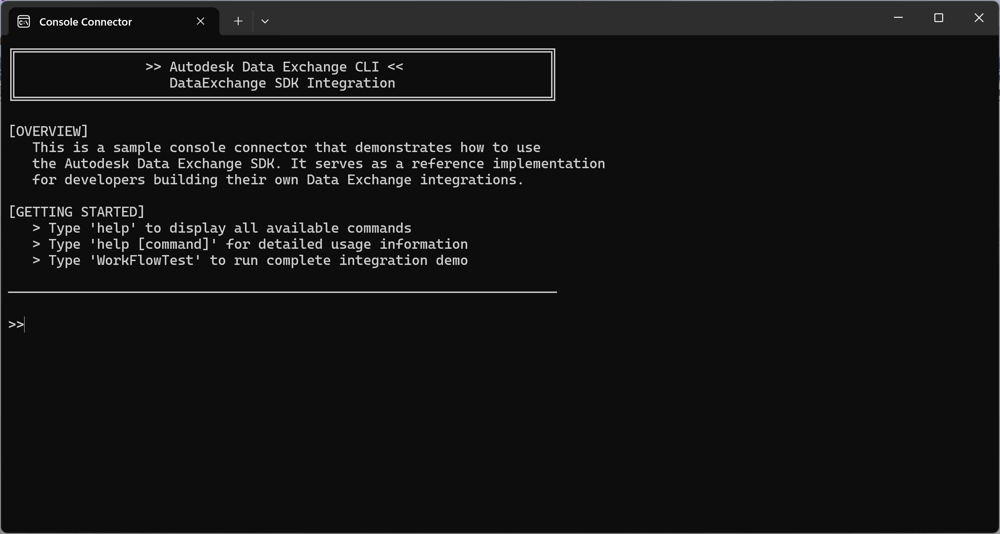

# Autodesk Data Exchange Console Connector

[](http://developer.autodesk.com/)


[](LICENSE)

## 📋 Overview

This is a **sample console connector** that demonstrates how to use the Autodesk Data Exchange SDK without the UI component. It serves as a reference implementation for developers building their own Data Exchange integrations and provides a comprehensive example of SDK capabilities through a professional command-line interface.

**Perfect for:**
- Service-based integrations
- Custom UI development
- Learning Data Exchange SDK patterns
- Automated workflow testing
- Headless data processing



## 🎯 Key Features

### Core Functionality
- ✅ **Exchange Management** - Create, update, and retrieve exchanges
- ✅ **Multi-Format Geometry Processing** - BREP, IFC, Mesh, and Primitive geometries
- ✅ **Parameter Operations** - Add, modify, and delete instance/type parameters
- ✅ **Version Control** - Exchange synchronization and versioning
- ✅ **Data Export** - Download exchanges as STEP or OBJ files
- ✅ **Folder Management** - Set and manage working directories

### Developer Experience
- 🚀 **Professional Console Interface** - Clean, categorized output messages
- 📋 **Comprehensive Workflow Testing** - Complete end-to-end validation
- 💻 **Command-Based Architecture** - Extensible command pattern
- 🔧 **Error Handling** - Robust error management and user feedback
- 📖 **Built-in Help System** - Detailed command documentation

## 🛠️ Prerequisites

1. **Autodesk Platform Services App**
   - [Register an app](https://aps.autodesk.com/myapps/)
   - Select **Data Management** and **Data Exchange** APIs
   - Note your **Client ID**, **Client Secret**, and **Auth Callback**

2. **Development Environment**
   - Visual Studio 2019 or later
   - .NET Framework 4.8
   - Basic knowledge of C#

3. **Access Requirements**
   - [Autodesk Construction Cloud](https://acc.autodesk.com/) (ACC) access
   - Valid Autodesk account with appropriate permissions

## 🚀 Quick Start

### 1. Clone and Setup
```bash
git clone https://github.com/your-repo/aps-dataexchange-console.git
cd aps-dataexchange-console
```

### 2. Install Dependencies
Follow the [Data Exchange .NET SDK installation guide](https://aps.autodesk.com/en/docs/dx-sdk-beta/v1/developers_guide/installing_the_sdk/#procedure):

**Option A: Visual Studio**
- Open `ConsoleConnector.sln`
- Build the solution (packages restore automatically)

**Option B: Command Line**
```bash
# Run from project root
BuildSolution.bat
```

### 3. Configuration
Update `src/ConsoleConnector/App.config` with your app credentials:
```xml
<appSettings>
    <add key="APS_CLIENT_ID" value="your_client_id" />
    <add key="APS_CLIENT_SECRET" value="your_client_secret" />
    <add key="APS_CALLBACK_URL" value="your_callback_url" />
</appSettings>
```

### 4. Run the Application
- Build and run the console application
- Complete OAuth authentication in the browser
- Start using commands in the console interface

## 💻 Usage Examples

### Basic Commands
```bash
# Get help
>> help

# Set working folder (using folder URL)
>> SetFolder [FolderUrl]
# OR set working folder (using individual parameters)
>> SetFolder [HubId] [Region] [ProjectUrn] [FolderUrn]

# Create a new exchange
>> CreateExchange [ExchangeTitle]

# Add BREP geometry
>> AddBrep [ExchangeTitle]

# Add instance parameters
>> AddInstanceParameter [ExchangeTitle] [ElementId] [ParameterName] [ParameterSchema] [ParameterValue] [ParameterValueDataType]

# Sync changes
>> SyncExchange [ExchangeTitle]

# Download exchange
>> GetExchange [ExchangeId] [CollectionId] [HubId] [ExchangeFileFormat]
```

### Complete Workflow Test
```bash
# Run comprehensive end-to-end test
>> WorkFlowTest
```

This command executes a complete workflow that:
1. Creates a new exchange
2. Adds multiple geometry types (BREP, IFC, Mesh, Primitives)
3. Adds instance and type parameters
4. Syncs to Version 1
5. Deletes some parameters
6. Adds more geometries and parameters
7. Syncs to Version 2
8. Downloads the final exchange

## 📚 Command Reference

| Command | Description | Example |
|---------|-------------|---------|
| `help` | Display all commands | `help` |
| `help [command]` | Get command details | `help CreateExchange` |
| `CreateExchange` | Create new exchange | `CreateExchange [ExchangeTitle]` |
| `AddBrep` | Add BREP geometry | `AddBrep [ExchangeTitle]` |
| `AddIFC` | Add IFC geometry | `AddIFC [ExchangeTitle]` |
| `AddMesh` | Add mesh geometry | `AddMesh [ExchangeTitle]` |
| `AddPrimitive` | Add primitives | `AddPrimitive [ExchangeTitle] [PrimitiveGeometry]` |
| `AddInstanceParameter` | Add instance parameter | `AddInstanceParameter [ExchangeTitle] [ElementId] [ParameterName] [ParameterSchema] [ParameterValue] [ParameterValueDataType]` |
| `AddTypeParameter` | Add type parameter | `AddTypeParameter [ExchangeTitle] [ElementId] [ParameterName] [ParameterSchema] [ParameterValue] [ParameterValueDataType]` |
| `DeleteInstanceParam` | Remove instance parameter | `DeleteInstanceParam [ExchangeTitle] [ElementId] [ParameterName]` |
| `DeleteTypeParam` | Remove type parameter | `DeleteTypeParam [ExchangeTitle] [ElementId] [ParameterName]` |
| `SyncExchange` | Sync exchange | `SyncExchange [ExchangeTitle]` |
| `GetExchange` | Download exchange | `GetExchange [ExchangeId] [CollectionId] [HubId] [ExchangeFileFormat]` |
| `SetFolder` | Set working folder | `SetFolder [FolderUrl]` or `SetFolder [HubId] [Region] [ProjectUrn] [FolderUrn]` |
| `WorkFlowTest` | Run complete test | `WorkFlowTest` |
| `Exit` | Close application | `Exit` |

## 🏗️ Architecture

```
ConsoleConnector/
├── Commands/           # Command implementations
│   ├── CreateExchangeCommand.cs
│   ├── CreateBrepCommand.cs
│   ├── WorkFlowTestCommand.cs
│   └── ...
├── Helper/            # Utility classes
│   ├── ConsoleAppHelper.cs
│   ├── GeometryHelper.cs
│   └── ParameterHelper.cs
├── Interfaces/        # Abstractions
└── Assets/           # Sample geometry files
```

### Key Components

- **Command Pattern**: Each operation is implemented as a separate command class
- **Helper Classes**: Reusable utilities for geometry, parameters, and console operations
- **Interface Abstractions**: Clean separation of concerns
- **Asset Management**: Sample files for testing and demonstration

## 🔧 Extending the Application

### Adding New Commands

1. Create a new command class inheriting from `Command`
2. Implement required methods (`Execute`, `Clone`, `ValidateOptions`)
3. Register the command in `ConsoleAppHelper`

```csharp
public class MyCustomCommand : Command
{
    public override async Task<bool> Execute()
    {
        Console.WriteLine("[CUSTOM] Executing my command");
        // Implementation here
        return true;
    }
    
    public override Command Clone()
    {
        return new MyCustomCommand(this);
    }
}
```

### Adding Command Options

1. Create option class in `Commands/Options/`
2. Add to command's `Options` list
3. Use `GetOption<T>()` to access values

## 📖 Documentation

- [Autodesk Data Exchange SDK](https://aps.autodesk.com/en/docs/dx-sdk-beta/v1/developers_guide/overview/)
- [SDK Without UI Tutorial](https://aps.autodesk.com/en/docs/dx-sdk-beta/v1/tutorials/sdk-without-ui/create-an-exchange-container/)
- [Authentication Guide](https://aps.autodesk.com/en/docs/oauth/v2/developers_guide/overview/)

## 🤝 Contributing

This is a sample project for reference purposes. While direct contributions may not be accepted, you're encouraged to:

1. Fork the repository for your own modifications
2. Report issues or suggestions
3. Share improvements with the community

## 📄 License

This sample code is part of the Autodesk Data Exchange .NET SDK (Software Development Kit) beta. It is subject to the license covering the Autodesk Data Exchange .NET SDK (Software Development Kit) beta.

## ✍️ Author

**Dhiraj Lotake** - *Autodesk*

---

## 🆘 Support

For SDK-related questions and support:
- [Autodesk Platform Services Documentation](https://aps.autodesk.com/)
- [Community Forums](https://forums.autodesk.com/)
- [SDK Issues](https://github.com/autodesk-platform-services)

---

*This sample demonstrates the power and flexibility of the Autodesk Data Exchange SDK for building custom integrations and automating design data workflows.*
