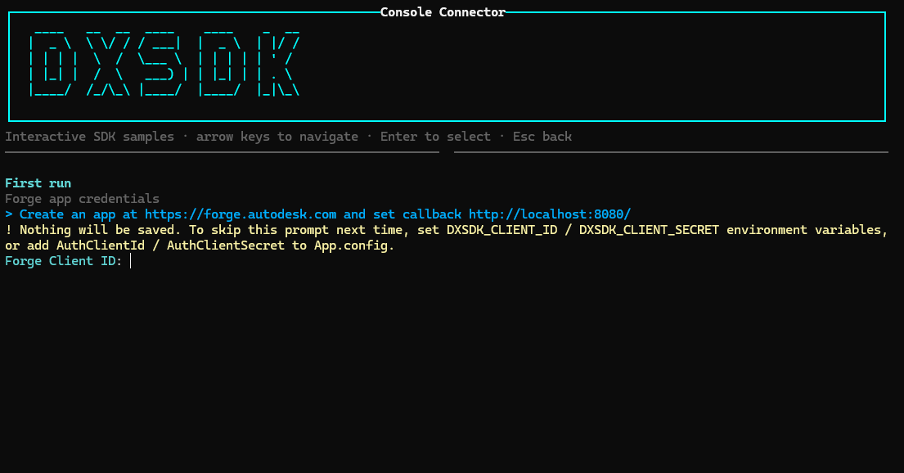

# Autodesk Data Exchange Console Connector

[](http://developer.autodesk.com/)


[](LICENSE)

## 📋 Overview

This is a **sample console connector** that demonstrates how to use the Autodesk Data Exchange SDK without the UI component. It serves as a reference implementation for developers building their own Data Exchange integrations and provides a comprehensive example of SDK capabilities through a professional command-line interface.

**Perfect for:**
- Service-based integrations
- Custom UI development
- Learning Data Exchange SDK patterns
- Automated workflow testing
- Headless data processing



## 🔗 Quick Navigation

- [🚀 Quick Start](#-quick-start) - Get up and running quickly
- [🔐 Credential Setup](#-credential-setup) - Env vars, App.config, and safe defaults
- [💻 Usage Examples](#-usage-examples) - See the console connector in action
- [📚 Sample Catalog](#-sample-catalog) - Complete list of categories and samples
- [🔄 Migration Guide](#-migration-guide-console-connector-architecture-revamp) - **Architecture Revamp Guide**
- [🏗️ Architecture](#️-architecture) - Understand the codebase structure
- [🔧 Extending the Application](#-extending-the-application) - Add custom functionality

## 🎯 Key Features

### Core Functionality
- ✅ **Exchange Management** - Create, update, and retrieve exchanges
- ✅ **Multi-Format Geometry Processing** - BREP, IFC, Mesh, and Primitive geometries
- ✅ **Parameter Operations** - Add, modify, and delete instance/type parameters
- ✅ **Version Control** - Exchange synchronization and versioning
- ✅ **Data Export** - Download exchanges as STEP, IFC, or OBJ files
- ✅ **Folder Management** - Navigate hubs, projects, and folders

### Developer Experience
- 🚀 **Interactive Console Menu** - Categorized, navigable sample catalog (11 categories, 100+ samples)
- 📋 **End-to-End Workflow Scenarios** - Self-contained, runnable demonstrations of complete flows
- 💻 **Sample-Based Architecture** - Every capability is a standalone `ISample` you can jump to directly (e.g. `4.1`) or run non-interactively via `--run-all`
- 🔧 **Error Handling** - Robust error management and user feedback
- 🔐 **Safe Credential Handling** - Environment variables first; nothing written to disk unless you opt in via `App.config`

## 🛠️ Prerequisites

1. **Autodesk Platform Services App**
   - [Register an app](https://aps.autodesk.com/myapps/)
   - Select **Data Management** and **Data Exchange** APIs
   - Note your **Client ID**, **Client Secret**, and **Auth Callback**

2. **Development Environment**
   - Visual Studio 2019 or later
   - .NET Framework 4.8
   - Basic knowledge of C#

3. **Access Requirements**
   - [Autodesk Construction Cloud](https://acc.autodesk.com/) (ACC) access
   - Valid Autodesk account with membership on the target hub/project
   - **Custom Integration** — your Forge app's **Client ID** must be added and approved under **ACC Hub Admin → Custom Integrations** for each hub you want to use (required for hub lookup from ACC/Forma URLs and for Data Management / Data Exchange API calls). See [ACC Custom Integration](#-acc-custom-integration) below.

## 🚀 Quick Start

### 1. Clone and Setup
```bash
git clone https://github.com/your-repo/aps-dataexchange-console.git
cd aps-dataexchange-console
```

### 2. Install Dependencies
[`Autodesk.DataExchange` 8.0.0](https://www.nuget.org/packages/Autodesk.DataExchange/8.0.0) is published on public nuget.org, so `BuildSolution.bat` restores it automatically. The remaining companion packages are still not on nuget.org — follow the [Data Exchange .NET SDK installation guide](https://aps.autodesk.com/en/docs/dx-sdk-beta/v1/developers_guide/installing_the_sdk/#procedure) to obtain them and drop them as loose `.nupkg` files in the **parent directory of your repo checkout**:
- `Autodesk.DataExchange.ADPAnalytics.Abstractions` (1.0.0)
- `Autodesk.DataExchange.GeometryDefinitions` (0.9.4)
- `ForgeParameters-csharp_win_release_intel64_v140` (3.0.6)
- `ForgeUnits-csharp_win_release_intel64_v140` (5.1.4)

**Option A: Visual Studio**
- Open `ConsoleConnector.sln`
- Build the solution (packages restore automatically)

**Option B: Command Line**
```bash
# Run from project root
BuildSolution.bat
```

### 3. Run the Application
- Build and run the console application (`ConsoleConnector.exe`)
- Complete OAuth authentication in the browser
- Navigate the interactive menu, or jump straight to a sample by its key (e.g. `4.1`)

See [🔐 Credential Setup](#-credential-setup) below before your first run.

## 🔐 Credential Setup

Credentials are resolved in this order, and **nothing is written to disk unless you explicitly opt into `App.config`**:

1. **Environment variables (recommended)** — `DXSDK_CLIENT_ID` / `DXSDK_CLIENT_SECRET`. Safe for CI and shared machines; never touches the filesystem.

   PowerShell:
   ```powershell
   $env:DXSDK_CLIENT_ID = "your_client_id"
   $env:DXSDK_CLIENT_SECRET = "your_client_secret"
   ```

   POSIX shells:
   ```bash
   export DXSDK_CLIENT_ID=your_client_id
   export DXSDK_CLIENT_SECRET=your_client_secret
   ```

2. **`App.config` (local-dev fallback)** — if the environment variables aren't set, the app reads `AuthClientId` / `AuthClientSecret` from `src/ConsoleConnector/App.config`:
   ```xml
   <appSettings>
       <add key="AuthClientId" value="" />
       <add key="AuthClientSecret" value="" />
       <add key="AuthCallback" value="http://localhost:8080/" />
       <add key="ConnectorName" value="Sample Connector" />
       <add key="ConnectorVersion" value="1.0.0" />
       <add key="HostApplicationName" value="Sample Host App" />
       <add key="HostApplicationVersion" value="2.0.0" />
   </appSettings>
   ```
   **Never commit real values here** — this file is tracked in git. Run `git diff`/`git status` before pushing if you edit it locally.

3. **One-off interactive prompt** — if neither of the above is set, the app prompts for credentials for that run only. Nothing is saved; you'll see a reminder of how to persist them via env vars or `App.config`.

Register your app and callback URL at [aps.autodesk.com/myapps](https://aps.autodesk.com/myapps/) with **Data Management** and **Data Exchange** APIs selected. The default callback is `http://localhost:8080/`, with `http://127.0.0.1:63212/`, `http://localhost:9090/`, and `http://localhost:3000/` as fallbacks if that port is in use.

## 🏢 ACC Custom Integration

Hub lookup (when you paste a Forma or ACC docs URL on first run) calls the APS API to find which hub owns a project. That only works when **both** of the following are true:

1. Your **Forge app is authorized** for the hub (Custom Integration).
2. Your **Autodesk account** must have access to the hub (and project).

### Steps (hub admin)

1. Open [ACC](https://acc.autodesk.com/) and select the **hub** that owns the project you need.
2. Go to **Hub Admin** → **Custom Integrations**.
3. Click **Add Custom Integration** (or **Add app**).
4. Paste your Forge app's **Client ID** from [aps.autodesk.com/myapps](https://aps.autodesk.com/myapps/) — the same value as `DXSDK_CLIENT_ID` / `AuthClientId`.
5. **Approve** the integration.
6. Sign in to the console with an account that has access to that hub.
7. Set the session folder again — choose **Retry (added Custom Integration?)** after pasting the ACC URL, or enter Hub Id / Project URN / Folder URN manually. Use **1.1 List Hubs** and **1.2 List Projects** to confirm access.

### If hub lookup still fails

- Do **not** reuse a Hub Id from a different account — each project belongs to one hub.
- ACC docs URLs include `projects/{id}` and `folderUrn=…` but **not** `hubId`; lookup depends on Custom Integration + user access.
- Enter Hub Id manually only after **1.2 List Projects** shows the project under that hub.

The console prints these steps automatically when hub lookup fails.

## 💻 Usage Examples

### Interactive Menu

Launch `ConsoleConnector.exe` and navigate the category menu (Navigation, Exchange Lifecycle, Elements, Attach Geometry, Parameters, Design References, Download Exchange, Revisions, SDK Events, Debug & Telemetry, E2E Workflow Scenarios). From any menu:
- **`?` Show all samples** — prints the full catalog with keys (e.g. `4.1`, `5.2.1`)
- **`›` Jump to sample key** — type a key directly to run that sample without navigating menus

### Run Everything Non-Interactively

```bash
ConsoleConnector.exe --run-all
```

Runs every registered sample once, using defaults for any prompts, and prints a pass/fail summary — useful for smoke-testing after a change or in CI.

### End-to-End Workflow Scenarios (category 11)

Each scenario is a self-contained, runnable demonstration of a complete flow (e.g. "create exchange → add geometry → add parameters → sync"). Jump to any of them directly:

```text
11.1  Simple Exchange              - create + sync (empty)
11.2  Single Element With Geometry - create, root element, BREP, sync
11.4  Multi Geometry Multi Parameter - BREP + mesh + primitive + custom params
11.7  Two Version Round Trip       - create v1, modify v2, reload v1, diff
11.10 End To End Create Sync Download - full create + geometry + param + sync + download
```

## 📚 Sample Catalog

| # | Category | Samples |
|---|----------|---------|
| 1 | Navigation | Hubs, Projects, Folders, Exchanges |
| 2 | Exchange Lifecycle | Create, Load, Sync, Refresh, Revisions, Delete |
| 3 | Elements | Add root/child, list, get by id, delete, attributes, modifications |
| 4 | Attach Geometry | BREP/STEP, IFC, Mesh, Primitives, Advanced (render style, transforms, units, streams) |
| 5 | Parameters | Instance (built-in/custom/batch/update), Type, Misc (model/geometry-level, references) |
| 6 | Design References | Create, instantiate, query by id/name |
| 7 | Download Exchange | STEP, IFC, OBJ |
| 8 | Revisions | Created/modified/deleted/all-changed elements |
| 9 | SDK Events | Subscribe/unsubscribe to exchange updates, viewable generation progress |
| 10 | Debug & Telemetry | HTTP debug logging, feature flags, progress steps, telemetry sessions |
| 11 | E2E Workflow Scenarios | 10 self-contained end-to-end demonstrations |

Every sample implements `ISample` and is discovered automatically via reflection (`SampleAddressAttribute`) — see [Extending the Application](#-extending-the-application).

## 🏗️ Architecture

```
ConsoleConnector/
├── Driver/              # App plumbing: menu, bootstrap, credentials, terminal UI
│   ├── Menu.cs
│   ├── CredentialsBootstrap.cs
│   ├── SdkBootstrap.cs
│   ├── SampleDiscovery.cs
│   ├── SampleRunner.cs
│   └── ...
├── Common/              # Shared helpers reused across samples
│   ├── ExchangeSessionHelper.cs
│   ├── ElementSampleHelper.cs
│   ├── GeometrySampleHelper.cs
│   ├── ParameterSampleHelper.cs
│   └── ...
├── Samples/             # One ISample per capability, organized by category
│   ├── Navigation/
│   ├── ExchangeLifecycle/
│   ├── Elements/
│   ├── AttachGeometry/
│   ├── Parameters/
│   ├── DesignReferences/
│   ├── DownloadExchange/
│   ├── Revisions/
│   ├── SdkEvents/
│   ├── DebugTelemetry/
│   └── E2EWorkflowScenarios/
└── Assets/              # Sample geometry files
```

### Key Components

- **`ISample`**: every capability implements this interface (`Name`, `Description`, `RunAsync(ctx)`); discovered automatically via the `[SampleAddress(category, sample, subSample)]` attribute
- **`Common/*Helper` classes**: the only thing samples are allowed to compose — no sample ever instantiates another sample directly, keeping every example runnable and readable on its own
- **`SampleContext`**: carries the SDK client, session folder, and defaults between samples in a single run
- **`Driver/`**: everything that isn't part of the SDK story — menu navigation, credential resolution, session persistence, terminal rendering

## 🔧 Extending the Application

### Adding a New Sample

1. Create a class implementing `ISample` under the appropriate `Samples/<Category>/` folder
2. Tag it with `[SampleAddress(categoryId, sampleId, subSampleId = 0)]`
3. Implement the SDK call using existing `Common/*Helper` methods where possible

```csharp
[SampleAddress(3, 10)]
public sealed class MyCustomSample : ISample
{
    public string Name => "My Custom Sample";
    public string Description => "Demonstrates my custom SDK capability";

    public async Task RunAsync(SampleContext ctx)
    {
        var session = await ElementSampleHelper.BeginAsync(ctx);
        if (session == null)
            return;

        // Your SDK call here.

        await ElementSampleHelper.SyncAsync(ctx, session);
    }
}
```

Add the file to `ConsoleConnector.csproj`'s `<Compile Include="..." />` list (the project uses an old-style `.csproj` without globbing) — the sample is then automatically discovered and appears in the menu under its category.

### Adding Shared Logic

If a piece of logic is needed by more than one sample, add it to the relevant `Common/*Helper` class instead of duplicating it — samples should stay thin wrappers over `Common` helpers.

## 🔄 Migration Guide: Console Connector Architecture Revamp

This section documents replacing the Command-pattern console app with a menu-driven, sample-based architecture, landed as a sequence of category-wise PRs.

### 📋 Overview of Changes

- **Architecture**: `Commands/`/`Helper/`/`Interfaces/` replaced by `Driver/` (menu, bootstrap, terminal UI) + `Common/` (shared helpers) + `Samples/` (one `ISample` per capability, organized by category)
- **Credentials**: no longer persisted to a plaintext session file. Resolved from `DXSDK_CLIENT_ID`/`DXSDK_CLIENT_SECRET` env vars → `App.config` → a one-off prompt that is never saved (see [🔐 Credential Setup](#-credential-setup))
- **Tests**: added an MSTest+Moq scaffold covering the `Driver`/`Common` surface (credential resolution, session state mapping, sample discovery/runner, and the pure helper logic)
- **Breaking Changes**: Yes — the CLI-args command interface (`>> CreateExchange [Title]`, `>> WorkFlowTest`, etc.) is replaced entirely by the interactive menu / `--run-all` / jump-to-key interface described in [Usage Examples](#-usage-examples)
- **Build result**: 0 errors after fixes applied

### 🚀 Key Dependency Updates

| Package | Reason |
|---------|--------|
| `Autodesk.DataExchange.ADPAnalytics.Abstractions` (1.0.0) | `Client.Initialize()` requires this companion assembly at runtime against 7.6.0-beta; not previously declared |
| `Autodesk.DataExchange.GeometryDefinitions` (bumped to 0.9.4) | Exact version pinned by the SDK's own nuspec for 7.6.0-beta |
| `Spectre.Console` / `Spectre.Console.Ansi` (0.57.2) | Powers the interactive menu, tables, and prompts |
| `Microsoft.Bcl.TimeProvider`, `System.Memory`/`System.Buffers`/`System.Numerics.Vectors`/`System.Runtime.CompilerServices.Unsafe` (bumped) | Transitive requirements of `Spectre.Console` on net48 |
| `IndexRange` | Polyfills `System.Index`/`System.Range` (`^1`, `a..b` syntax) on net48 |

### ⚠️ Breaking Changes

#### 1. The CLI-args command interface is gone

**Before:**
```bash
>> CreateExchange [ExchangeTitle]
>> AddBrep [ExchangeTitle]
>> SyncExchange [ExchangeTitle]
```

**After:** navigate the interactive menu, or jump directly to a sample key:
```text
4.1   (jump to "Add BREP from STEP file")
```
or run everything non-interactively:
```bash
ConsoleConnector.exe --run-all
```

**Migration Action:** if you had scripts driving the old CLI syntax, replace them with `--run-all` for full-catalog runs, or automate via the `ISample` API directly (each sample is a public class with a `RunAsync(SampleContext)` method).

#### 2. Credential storage changed

**Before:** `App.config` was the only credential source, and real values were checked into git history.

**After:** environment variables are checked first and are never written to disk; `App.config` is a documented fallback that ships with empty values by default.

**Migration Action:** set `DXSDK_CLIENT_ID`/`DXSDK_CLIENT_SECRET`, or fill in your own local (never committed) `App.config` values.

### 🔧 Migration Steps

#### Step 1: Set credentials

See [🔐 Credential Setup](#-credential-setup).

#### Step 2: Restore and Rebuild

```bash
BuildSolution.bat
```

#### Step 3: Verify

```bash
ConsoleConnector.exe --run-all
```

Confirms every registered sample runs without an unhandled exception and prints a pass/fail summary.

### 🎯 Summary of Changes

| Aspect | Before | After |
|--------|--------|-------|
| Entry point | CLI-args commands (`>> CreateExchange ...`) | Interactive menu, jump-to-key, or `--run-all` |
| Credential storage | `App.config` only (real values in git history) | Env vars → `App.config` (empty by default) → one-off prompt |
| Extensibility | New `Command` subclass + `Options/` + registration in `ConsoleAppHelper` | New `ISample` + `[SampleAddress]`, auto-discovered |
| Test coverage | 11 MSTest cases against the Command pattern | 32 MSTest cases against `Driver`/`Common` |
| Upgrade effort | - | 14 stacked PRs — foundation, tests, E2E scenarios, then one PR per sample category |

### 🧪 Testing Your Migration

```bash
ConsoleConnector.exe --run-all
```

This validates every registered sample across all 11 categories runs without throwing. For unit-level coverage, run the MSTest suite in `test/ConsoleConnector_Test`.

---

**Migration Checklist:**
- [x] Replaced `Commands`/`Helper`/`Interfaces` with `Driver`/`Common`/`Samples`
- [x] Credentials resolved via env vars → `App.config` → one-off prompt, nothing persisted by default
- [x] Added MSTest+Moq coverage for the new `Driver`/`Common` surface
- [x] Made all 10 E2E workflow scenarios self-contained (no sample instantiates another sample)
- [x] Ported all 11 sample categories (104 samples total)
- [x] Ran `--run-all` to confirm full-catalog coverage

---

## 🔄 Migration Guide: SDK 8.0.0 Upgrade

This section documents the migration from SDK 7.6.0-beta to **Autodesk Data Exchange SDK 8.0.0** (first publicly released 8.x). 

### Overview of Changes

- **SDK Version**: Upgraded to `Autodesk.DataExchange 8.0.0` (assembly version `8.0.0.0`)
- **Public availability**: 8.0.0 ships on public nuget.org — the SDK nupkg no longer has to be side-loaded from the parent directory
- **Geometry attach**: Use `AddElementGeometry` instead of `SetElementGeometry` when appending geometry to an element (preserves existing geometry)
- **ACC version display**: Loaded panel and post-sync output show the ACC file version number parsed from `FileVersionUrn`
- **API signature changes**: collection-based `GetExchangeDetailsAsync`, updated OBJ download signature
- **Reference cleanup**: the `System.Runtime.InteropServices.RuntimeInformation` facade `<Reference>` must be removed on net48
- **Build result**: 0 errors, 38/38 unit tests passing

### Key API Change: AddElementGeometry

`SetElementGeometry` replaces the element's entire geometry set. To append new geometry without deleting what is already attached, use `AddElementGeometry`:

**Before (7.6.0-beta):**
```csharp
model.SetElementGeometry(element, new List<IElementGeometry> { geometry });
```

**After (8.0.0):**
```csharp
model.AddElementGeometry(element, new List<IElementGeometry> { geometry });
```

### Reference Cleanup: System.Runtime.InteropServices.RuntimeInformation

The `System.Runtime.InteropServices.RuntimeInformation` 4.3.0 facade assembly is redundant on net48 and collides with `mscorlib`, producing:

```
error CS0433: The type 'RuntimeInformation' exists in both
'System.Runtime.InteropServices.RuntimeInformation, Version=4.0.1.0' and 'mscorlib, Version=4.0.0.0'
```

The `<Reference>` was removed from both `.csproj` files; `RuntimeInformation`/`OSPlatform` resolve from `mscorlib` on net48.

### ⚠️ Breaking Changes in 8.0.0 — and why this connector absorbed so few

8.0.0 is a major release with real breaking changes: `IStorage.Save()` gained a required key, the
`DownloadCompleteExchangeAs*` family collapsed to a single `DataExchangeIdentifier` shape,
`ElementProperties` was deleted outright, `Autodesk.DataExchange.BaseModels.dll` stopped shipping as
a standalone assembly, and everything marked `[Obsolete]` in 7.6.0-beta was removed.

This connector needed **no source changes** for the SDK bump — not because the release is small, but
because this repo is a console app with no UI SDK dependency and it moved off the obsolete APIs
during the 7.6.0-beta upgrade and the architecture revamp. The audit below records each 8.0.0
breaking change and why it does or does not land here, so the absence of code churn is verifiable
rather than assumed.

| 8.0.0 breaking change | Impact here | Why |
|-----------------------|-------------|-----|
| `IStorage.Save()` → `Save(string key, string group = null)` | **None** | This connector never uses the SDK's `IStorage`. Session state lives in `Driver/SessionStore.cs` as its own JSON file |
| `DownloadCompleteExchangeAs{OBJ,STEP,IFC,USD}` take a `DataExchangeIdentifier` instead of `(exchangeId, collectionId, …)` | **None** | Already on the identifier overload — see `Common/DownloadSampleHelper.cs` and the `Samples/DownloadExchange/*` samples, which all pass `session.Identifier` |
| `ElementProperties` and `AddElement(ElementProperties)` removed | **None** | Elements are built with `AddElement(id, name)` + `Classify` + `DefineType` + `SetType` (`Common/ElementSampleHelper.cs`). `ElementProperties` no longer appears anywhere in the 8.0.0 assembly |
| `Autodesk.DataExchange.BaseModels.dll` merged into `Autodesk.DataExchange.UI.Bridge.dll` | **None** | Console app — `Autodesk.DataExchange.UI` is not referenced by either project, so there is no `BaseExchangeModel`/`ExchangeUrl` consumption and no stale-DLL risk |
| `[Obsolete]` APIs from 7.6.0-beta deleted (`RetrieveLatestExchangeDataAsync`, `IElement.Id`, `DeleteElement(string)`, `DeleteElementsById`, `GetElementById`/`GetElementsById`, `CreateDesignRef`, `GetDesignsById`, `InstantiateDesignById`, `ExchangeCreateRequestACC.ACCProjectURN`, …) | **None** | Migrated in the 7.6.0 step: `Common/DeltaSampleHelper.cs` uses `RetrieveLatestExchangeAsync(model, ct)`, `Samples/Elements/DeleteElementSample.cs` uses `DeleteElementByUniqueId(element.UniqueId)`, and the design samples use `GetOrCreateDesignRef`, which is still present in 8.0.0 |
| ADP analytics registration entry points (`SDKOptions.RegisterAdpAnalytics`, `AddAdpAnalytics`) removed | **None** | Never called here. `Autodesk.DataExchange.ADPAnalytics.Abstractions` (1.0.0) stays as a runtime-only dependency of `Client.Initialize()` |
| `System.Runtime.InteropServices.RuntimeInformation` facade collides with mscorlib | **Build break** | The only change this upgrade actually forced — see [Reference Cleanup](#reference-cleanup-systemruntimeinteropservicesruntimeinformation) above |

**Verified still present in 8.0.0** (checked against `Autodesk.DataExchange.xml` shipped in the
package), so the corresponding call sites compile unchanged:

- `IClient.GetExchangeDetailsAsync(string collectionId, string fileUrn)` — alongside the newer
  `GetExchangeDetailsAsync(IDataExchangeIdentifier)` overload
- `ElementDataModel.CreateFileGeometry(string path, GeometryFormat, RenderStyle, Units, string)` and
  its `MemoryStream` counterpart
- `IElementDataModel.GetOrCreateDesignRef(IElement, string, string)`

> If you are upgrading a connector that **did** use the removed APIs — particularly a WPF connector
> on `Autodesk.DataExchange.UI` — do the 7.6.0-beta step first. 8.0.0 no longer offers an
> obsolete-but-working path, so anything you deferred there turns into a `CS0117`/`CS1061` compile
> error. The [Sample UI Connector migration guide](https://github.com/autodesk-platform-services/aps-dataexchange-connector/blob/main/migration-guide.md)
> documents those code fixes in detail.

### Migration Steps

1. Update `packages.config` (`version="8.0.0"`) and `.csproj` HintPaths / `Import` / `Error` conditions to `Autodesk.DataExchange.8.0.0`
2. Bump the assembly reference to `Version=8.0.0.0`
3. Replace append-style `SetElementGeometry` calls with `AddElementGeometry`
4. Adapt to the collection-based `GetExchangeDetailsAsync` and the updated OBJ download signature
5. Remove the `System.Runtime.InteropServices.RuntimeInformation` `<Reference>` from both projects
6. Restore NuGet packages and rebuild
7. Work the audit table above against your own code — every row that says "None" here is a real
   break for connectors that use that API

### 🧪 Testing Your Migration

After upgrading, confirm:

- ✅ `msbuild ConsoleConnector.sln -p:Configuration=Debug -p:Platform=x64` builds with 0 errors
- ✅ The build still succeeds from a clean output directory (`-t:Rebuild`, or delete `bin`/`obj`
  first) — this rules out a stale 7.x `Autodesk.DataExchange.dll` in `bin/` satisfying the loader
  and masking the upgrade
- ✅ The copied output assembly really is 8.0.0.0:
  `[Reflection.AssemblyName]::GetAssemblyName("src/ConsoleConnector/bin/x64/Debug/Autodesk.DataExchange.dll").Version`
- ✅ The MSTest suite passes (38/38)
- ✅ `--run-all` walks the full sample catalogue without throwing
- ✅ Load an exchange — the ACC file version shows in the Loaded panel
- ✅ Attach a second geometry to an element — the first one survives (`AddElementGeometry`)
- ✅ Sync — the ACC version increments and the Loaded panel updates

**Migration Checklist:**
- [x] Bumped `packages.config` and both `.csproj` files to `Autodesk.DataExchange` 8.0.0 / `Version=8.0.0.0`
- [x] Removed the `System.Runtime.InteropServices.RuntimeInformation` facade `<Reference>`
- [x] Audited every 8.0.0 breaking change against this codebase (table above)
- [x] Rebuilt clean with `-t:Rebuild` (0 errors) and verified the output assembly is 8.0.0.0
- [x] Ran the MSTest unit test suite (38/38 passed)
- [ ] Ran the load / attach / sync workflows end to end against ACC

---

## 🔄 Migration Guide: SDK 7.6.0 Upgrade

This section documents the migration from SDK 7.5.0 to **Autodesk Data Exchange SDK 7.6.0-beta**.

### 📋 Overview of Changes

- **SDK Version**: Upgraded to `Autodesk.DataExchange 7.6.0-beta`
- **Breaking Changes**: Yes — several `Element`/`ElementDataModel` APIs moved from concrete classes to interfaces (see below)
- **Build result**: 0 errors after fixes applied

### 🚀 Key Dependency Updates

| Package | Previous Version | New Version | Impact |
|---------|------------------|-------------|---------|
| `Autodesk.DataExchange` | `7.5.0-beta` | `7.6.0-beta` | **Minor** - a few breaking changes |

### ⚠️ Breaking Changes

#### 1. `Client.GetElementDataModelAsync` now returns `IElementDataModel` instead of `ElementDataModel`

The concrete `Autodesk.DataExchange.DataModels.ElementDataModel` class still exists and still implements `IElementDataModel`, so an explicit cast is sufficient — no data model changes required.

**Before (7.5.0):**
```csharp
currentExchangeData = (await Client.GetElementDataModelAsync(exchangeIdentifier)).Value;
```

**After (7.6.0-beta):**
```csharp
currentExchangeData = (ElementDataModel)(await Client.GetElementDataModelAsync(exchangeIdentifier)).Value;
```

**Migration Action:** Add an explicit cast to `ElementDataModel` wherever `Client.GetElementDataModelAsync(...).Value` is assigned to an `ElementDataModel`-typed variable or dictionary.

#### 2. `IElementDataModel.Elements` yields `IElement`, not `Element`

Iterating `elementDataModel.Elements` (e.g. via `FirstOrDefault`) now produces `IElement` instances. Code paths that pass a retrieved element into a method typed to accept the concrete `Element` class no longer compile.

**Migration Action:** Change parameter types that receive a *retrieved* element (as opposed to one just created via `AddElement`) from `Element` to `IElement` — e.g. `ParameterHelper.AddCustomParameter`/`AddBuiltInParameter` in `Helper/ParameterHelper.cs`.

#### 3. `IElement.Type` / `Element.Type` is now `IElementType`, not `string`

`Element.Type` used to be a plain string (e.g. `"Walls"`). The interface-typed `IElement.Type` returns `IElementType`, which exposes the same value via `IClassification.Value`.

**Before (7.5.0):**
```csharp
elementDataModel.DeleteTypeParameter(element.Type, parameterName.Value);
```

**After (7.6.0-beta):**
```csharp
elementDataModel.DeleteTypeParameter(element.Type.Value, parameterName.Value);
```

Similarly, prefer the new handle-based `AddTypeParameterAsync(IElementType, IParameter)` over the by-name `CreateTypeParameterAsync(string, IParameter)` when a type handle is already available (avoids a global name lookup):

```csharp
await elementDataModel.AddTypeParameterAsync(element.Type, parameter);
```

**Migration Action:** Replace `element.Type` usages that need a string with `element.Type.Value`, and switch `CreateTypeParameterAsync(element.Type, ...)` calls to `AddTypeParameterAsync(element.Type, ...)`.

### 🔧 Migration Steps

#### Step 1: Update Package References

Update your `packages.config`:

```xml
<package id="Autodesk.DataExchange" version="7.6.0-beta" targetFramework="net48" />
```

Update `ConsoleConnector.csproj` and `ConsoleConnector_Test.csproj`:
- Assembly version: `Version=7.5.0.0` → `Version=7.6.0.0`
- HintPaths: `Autodesk.DataExchange.7.5.0-beta\` → `Autodesk.DataExchange.7.6.0-beta\`
- Build target imports: same substitution

#### Step 2: Apply the Code Fixes

1. **`ConsoleAppHelper.cs`** — cast `Client.GetElementDataModelAsync(...).Value` (`IElementDataModel`) to `ElementDataModel` at both call sites.
2. **`ParameterHelper.cs`** — change `AddCustomParameter`/`AddBuiltInParameter` element parameters from `Element` to `IElement`; switch `CreateTypeParameterAsync(element.Type, ...)` to `AddTypeParameterAsync(element.Type, ...)`.
3. **`DeleteParameter.cs`** — change `element.Type` to `element.Type.Value` in both `DeleteTypeParameter` calls.

#### Step 3: Restore and Rebuild

**Command Line:**
```bash
BuildSolution.bat
```

#### Step 4: Verify

Run the comprehensive workflow test to confirm everything works as expected:

```bash
>> WorkFlowTest
```

### 🎯 Summary of Changes

| Aspect | SDK 7.5.0 | SDK 7.6.0-beta |
|--------|-----------|-----------------|
| Element retrieval | Returns `ElementDataModel`/concrete `Element` | Returns `IElementDataModel`/`IElement` |
| Element type | `Element.Type` is `string` | `IElement.Type` is `IElementType` (use `.Value` for the string) |
| Upgrade effort | - | ~20 min — 3 files changed |

### 🧪 Testing Your Migration

After upgrading, run the comprehensive workflow test:

```bash
>> WorkFlowTest
```

This command validates:
- ✅ Exchange creation and management
- ✅ Geometry processing (BREP, IFC, Mesh, Primitives)
- ✅ Parameter operations
- ✅ Synchronization workflows
- ✅ File download capabilities

---

**Migration Checklist:**
- [x] Updated all package references to 7.6.0-beta
- [x] Fixed `Element`/`ElementDataModel` → `IElement`/`IElementDataModel` breaking changes
- [x] Restored NuGet packages and rebuilt the solution (0 errors)
- [x] Ran the MSTest unit test suite (11/11 passed)
- [ ] Tested core workflows with `WorkFlowTest`

---

## 🔄 Migration Guide: SDK 7.5.0 Upgrade

This section documents the migration from SDK 7.4.0 to **Autodesk Data Exchange SDK 7.5.0**.

### 📋 Overview of Changes

- **SDK Version**: Upgraded to `Autodesk.DataExchange 7.5.0-beta`
- **Breaking Changes**: Yes — 1 code change required (see below)
- **Build result**: 0 errors after fixes applied

### 🚀 Key Dependency Updates

| Package | Previous Version | New Version | Impact |
|---------|------------------|-------------|---------|
| `Autodesk.DataExchange` | `7.4.0-beta` | `7.5.0-beta` | **Minor** - 1 breaking change |

### ⚠️ Breaking Changes

#### 1. `Client.GenerateViewableAsync` removed — viewable generation is now server-side

In SDK 7.5.0 viewable generation is handled **server-side**. The client-side
`Client.GenerateViewableAsync` API was removed with **no replacement** — after
`SyncExchangeDataAsync` completes, the service generates the viewable automatically.

**Before (7.4.0):**
```csharp
await Client.SyncExchangeDataAsync(dataExchangeIdentifier, exchangeData);
await Client.GenerateViewableAsync(exchangeDetails.ExchangeID, exchangeDetails.CollectionID);
```

**After (7.5.0):**
```csharp
await Client.SyncExchangeDataAsync(dataExchangeIdentifier, exchangeData);
// Viewable generation is handled server-side in SDK 7.5.0; the client-side
// Client.GenerateViewableAsync API was removed (no replacement).
```

**Migration Action:** Remove all calls to `Client.GenerateViewableAsync`.

### 🔧 Migration Steps

#### Step 1: Update Package References

Update your `packages.config`:

```xml
<package id="Autodesk.DataExchange" version="7.5.0-beta" targetFramework="net48" />
```

Update `ConsoleConnector.csproj` and `ConsoleConnector_Test.csproj`:
- Assembly version: `Version=7.4.0.0` → `Version=7.5.0.0`
- HintPaths: `Autodesk.DataExchange.7.4.0-beta\` → `Autodesk.DataExchange.7.5.0-beta\`
- Build target imports: same substitution

#### Step 2: Apply the Code Fix

1. **`ConsoleAppHelper.cs`** — remove the `Client.GenerateViewableAsync` call after `SyncExchangeDataAsync`.
2. **`SyncExchangeGeometry.cs`** — remove the `Client.GenerateViewableAsync` call after `SyncExchangeDataAsync`.

#### Step 3: Restore and Rebuild

**Command Line:**
```bash
BuildSolution.bat
```

#### Step 4: Verify

Run the comprehensive workflow test to confirm everything works as expected:

```bash
>> WorkFlowTest
```

### 🎯 Summary of Changes

| Aspect | SDK 7.4.0 | SDK 7.5.0 |
|--------|-----------|-----------|
| Viewable generation | Client-side via `GenerateViewableAsync` | Server-side; API removed |
| Upgrade effort | - | ~10 min — 2 files changed |

### 🧪 Testing Your Migration

After upgrading, run the comprehensive workflow test:

```bash
>> WorkFlowTest
```

This command validates:
- ✅ Exchange creation and management
- ✅ Geometry processing (BREP, IFC, Mesh, Primitives)
- ✅ Parameter operations
- ✅ Synchronization workflows
- ✅ File download capabilities

---

**Migration Checklist:**
- [x] Updated all package references to 7.5.0-beta
- [x] Restored NuGet packages and rebuilt the solution (0 errors)
- [x] Removed `Client.GenerateViewableAsync` calls
- [ ] Tested core workflows with `WorkFlowTest`

---

## 🔄 Migration Guide: SDK 7.4.0 Upgrade

This section documents the migration from SDK 7.2.1 to **Autodesk Data Exchange SDK 7.4.0**.

### 📋 Overview of Changes

- **SDK Version**: Upgraded to `Autodesk.DataExchange 7.4.0-beta`
- **Breaking Changes**: Yes — 3 code changes required (see below)
- **Build result**: 0 errors after fixes applied

### 🚀 Key Dependency Updates

| Package | Previous Version | New Version | Impact |
|---------|------------------|-------------|---------|
| `Autodesk.DataExchange` | `7.2.1-beta` | `7.4.0-beta` | **Minor** - 3 breaking changes |

### ⚠️ Breaking Changes

#### 1. `SDKOptionsDefaultSetup` — auth properties removed from initializer

`ConnectorName`, `ConnectorVersion`, `HostApplicationName`, `HostApplicationVersion` still exist on the base `SDKOptions` class and must be set there, but can still be set in the `SDKOptionsDefaultSetup` initializer. A new `FallbackRedirectUrls` property was added for port-conflict handling.

**Before (7.2.1):**
```csharp
var sdkOptions = new SDKOptionsDefaultSetup()
{
    ClientId = authClientId,
    CallBack = authCallBack,
    ClientSecret = authClientSecret,
    ConnectorName = "ConsoleConnector",
    ConnectorVersion = "1.0.0",
    HostApplicationName = "ConsoleConnector",
    HostApplicationVersion = "1.0",
};
Client = new Client(sdkOptions);
```

**After (7.4.0):**
```csharp
var sdkOptions = new SDKOptionsDefaultSetup()
{
    ClientId = authClientId,
    CallBack = authCallBack,
    ClientSecret = authClientSecret,
    ConnectorName = "ConsoleConnector",
    ConnectorVersion = "1.0.0",
    HostApplicationName = "ConsoleConnector",
    HostApplicationVersion = "1.0",
};

// Auth must be obtained BEFORE new Client() — the ctor calls Initialize() → GetHashedUserId() internally
var auth = new Auth(new AuthOptions { ClientId = authClientId, ClientSecret = authClientSecret, CallBack = authCallBack });
await auth.GetAuthTokenAsync();
sdkOptions.AuthProvider = auth;   // pre-assign so Client ctor reuses it

await Task.Run(() => { Client = new Client(sdkOptions); });
```

#### 2. `Client` constructor now calls `Initialize()` internally

`Client.Initialize()` is called inside the constructor — it requires a valid auth token at construction time. **Auth must be completed before `new Client(sdkOptions)` is called.**

The fix is to pre-build an `Auth` instance, call `GetAuthTokenAsync()`, assign it to `sdkOptions.AuthProvider`, and then construct the client. `InitializeSDKOptions` (called inside the ctor) skips creating a new `AuthProvider` if one is already set.

#### 3. `RenderStyle` and `RGBA` default constructors marked `[Obsolete]`

Property setters are deprecated. Use the parameterized constructors instead.

**Before (7.2.1):**
```csharp
RenderStyle renderStyle = new RenderStyle()
{
    Name = "My Style",
    RGBA = new RGBA() { Red = 255, Green = 0, Blue = 0, Alpha = 255 },
    Transparency = 1
};
```

**After (7.4.0):**
```csharp
RenderStyle renderStyle = new RenderStyle("My Style", new RGBA(255, 0, 0, 255), 1);
```

### 🔧 Migration Steps

#### Step 1: Update Package References

Update your `packages.config`:

```xml
<package id="Autodesk.DataExchange" version="7.4.0-beta" targetFramework="net48" />
```

Update `ConsoleConnector.csproj` and `ConsoleConnector_Test.csproj`:
- Assembly version: `Version=7.2.1.0` → `Version=7.4.0.0`
- HintPaths: `Autodesk.DataExchange.7.2.1-beta\` → `Autodesk.DataExchange.7.4.0-beta\`
- Build target imports: same substitution

#### Step 2: Apply the 3 Code Fixes

1. **`ConsoleAppHelper.cs`** — make `CreateClient` async, pre-authenticate before `new Client()`
2. **`GeometryHelper.cs`** — replace `new RenderStyle() { ... }` with `new RenderStyle(name, rgba, transparency)`

#### Step 3: Restore and Rebuild

**Command Line:**
```bash
BuildSolution.bat
```

#### Step 4: Verify

Run the comprehensive workflow test to confirm everything works as expected:

```bash
>> WorkFlowTest
```

### 🎯 Summary of Changes

| Aspect | SDK 7.2.1 | SDK 7.4.0 |
|--------|-----------|-----------|
| API surface | Stable | 3 breaking changes |
| `SDKOptionsDefaultSetup` | Sets all fields | Auth-only; metadata via `SDKOptions` base |
| `Client` construction | Sync, no pre-auth needed | Requires auth token before `new Client()` |
| `RenderStyle` / `RGBA` | Default constructor + setters | Parameterized constructors required |
| Auth flow | Token fetched lazily | Must call `GetAuthTokenAsync()` explicitly before `new Client()` |
| Upgrade effort | - | ~30 min — 2 files changed |

### 🧪 Testing Your Migration

After upgrading, run the comprehensive workflow test:

```bash
>> WorkFlowTest
```

This command validates:
- ✅ Exchange creation and management
- ✅ Geometry processing (BREP, IFC, Mesh, Primitives)
- ✅ Parameter operations
- ✅ Synchronization workflows
- ✅ File download capabilities

---

**Migration Checklist:**
- [x] Updated all package references to 7.4.0-beta
- [x] Restored NuGet packages and rebuilt the solution (0 errors)
- [x] Fixed `RenderStyle`/`RGBA` to use parameterized constructors
- [x] Fixed `CreateClientAsync` to pre-authenticate before `new Client()`
- [ ] Tested core workflows with `WorkFlowTest`
- [ ] Verified all geometry types render correctly

---

## 🔄 Migration Guide: SDK 7.2.1 Upgrade

This section documents the migration from SDK 7.2.0 to **Autodesk Data Exchange SDK 7.2.1**.

### 📋 Overview of Changes

This is a **non-breaking** upgrade focused on bug fixes and minor improvements:
- **SDK Version**: Upgraded to `Autodesk.DataExchange 7.2.1-beta`
- **No Breaking Changes**: All existing APIs remain fully compatible
- **Bug Fixes**: Various stability and reliability improvements

### 🚀 Key Dependency Updates

| Package | Previous Version | New Version | Impact |
|---------|------------------|-------------|---------|
| `Autodesk.DataExchange` | `7.2.0-beta` | `7.2.1-beta` | **Patch** - Bug fixes, no breaking changes |

### 🔧 Migration Steps

#### Step 1: Update Package References

Update your `packages.config`:

```xml
<package id="Autodesk.DataExchange" version="7.2.1-beta" targetFramework="net48" />
```

Or if using a `.csproj` `PackageReference`:

```xml
<PackageReference Include="Autodesk.DataExchange" Version="7.2.1-beta" />
```

#### Step 2: Restore and Rebuild

**Visual Studio:**
- Open `ConsoleConnector.sln`
- Rebuild the solution (packages restore automatically)

**Command Line:**
```bash
BuildSolution.bat
```

#### Step 3: Verify

Run the comprehensive workflow test to confirm everything works as expected:

```bash
>> WorkFlowTest
```

### 🎯 Summary of Changes

| Aspect | SDK 7.2.0 | SDK 7.2.1 |
|--------|-----------|-----------|
| API surface | Stable | No changes |
| Breaking changes | - | None |
| Upgrade effort | - | Version bump only |
| Key focus | Bug fixes & improvements | Bug fixes & improvements |

### 🧪 Testing Your Migration

After upgrading, run the comprehensive workflow test:

```bash
>> WorkFlowTest
```

This command validates:
- ✅ Exchange creation and management
- ✅ Geometry processing (BREP, IFC, Mesh, Primitives)
- ✅ Parameter operations
- ✅ Synchronization workflows
- ✅ File download capabilities

---

**Migration Checklist:**
- [ ] Updated all package references to 7.2.1-beta
- [ ] Restored NuGet packages and rebuilt the solution
- [ ] Tested core workflows with `WorkFlowTest`
- [ ] Verified all geometry types render correctly

---

<details>
<summary><strong>📜 Historical: SDK 7.1.0 → 7.2.0 Migration Guide</strong></summary>

This section documents the migration from SDK 7.1.0 to **Autodesk Data Exchange SDK 7.2.0**.

### 📋 Overview of Changes

This is a **non-breaking** upgrade focused on bug fixes and minor improvements:
- **SDK Version**: Upgraded to `Autodesk.DataExchange 7.2.0`
- **No Breaking Changes**: All existing APIs remain fully compatible
- **Bug Fixes**: Various stability and reliability improvements
- **Minor Improvements**: Internal enhancements to SDK performance

### 🚀 Key Dependency Updates

| Package | Previous Version | New Version | Impact |
|---------|------------------|-------------|---------|
| `Autodesk.DataExchange` | `7.1.0` | `7.2.0` | **Minor** - Bug fixes and improvements, no breaking changes |

### 🔧 Migration Steps

#### Step 1: Update Package References

Update your `packages.config`:

```xml
<package id="Autodesk.DataExchange" version="7.2.0" targetFramework="net48" />
```

Or if using a `.csproj` `PackageReference`:

```xml
<PackageReference Include="Autodesk.DataExchange" Version="7.2.0" />
```

#### Step 2: Restore and Rebuild

**Visual Studio:**
- Open `ConsoleConnector.sln`
- Rebuild the solution (packages restore automatically)

**Command Line:**
```bash
BuildSolution.bat
```

#### Step 3: Verify

Run the comprehensive workflow test to confirm everything works as expected:

```bash
>> WorkFlowTest
```

### 🎯 Summary of Changes

| Aspect | SDK 7.1.0 | SDK 7.2.0 |
|--------|-----------|-----------|
| API surface | Stable | No changes |
| Breaking changes | - | None |
| Upgrade effort | - | Version bump only |
| Key focus | API simplification | Bug fixes & improvements |

### 🧪 Testing Your Migration

After upgrading, run the comprehensive workflow test:

```bash
>> WorkFlowTest
```

This command validates:
- ✅ Exchange creation and management
- ✅ Geometry processing (BREP, IFC, Mesh, Primitives)
- ✅ Parameter operations
- ✅ Synchronization workflows
- ✅ File download capabilities

---

**Migration Checklist:**
- [ ] Updated all package references to 7.2.0
- [ ] Restored NuGet packages and rebuilt the solution
- [ ] Tested core workflows with `WorkFlowTest`
- [ ] Verified all geometry types render correctly

</details>

---

<details>
<summary><strong>📜 Historical: SDK 6.3.0 → 7.1.0 Migration Guide</strong></summary>

This section documents the previous migration from SDK 6.3.0 to **Autodesk Data Exchange SDK 7.1.0** and is preserved here for reference.

#### Overview of Changes

This upgrade included significant API changes:
- **SDK Version**: Upgraded to `Autodesk.DataExchange 7.1.0`
- **API Simplification**: Removed `GeometryProperties` wrapper class
- **Explicit Format Specification**: Geometry format now required as explicit parameter

#### Key Dependency Updates

| Package | Previous Version | New Version | Impact |
|---------|------------------|-------------|---------|
| `Autodesk.DataExchange` | `6.3.0` | `7.1.0` | **Major** - Breaking changes to geometry creation APIs |

#### Breaking Changes

##### 1. `GeometryProperties` Class Removed

The `GeometryProperties` class that was previously used to wrap geometry parameters was **removed entirely**. All methods that accepted `GeometryProperties` now take individual parameters directly.

##### 2. `CreateFileGeometry` API Change

**Before (SDK 6.3.0):**
```csharp
var geometry = ElementDataModel.CreateFileGeometry(
    new GeometryProperties(filePath, renderStyle));
```

**After (SDK 7.1.0):**
```csharp
var geometry = ElementDataModel.CreateFileGeometry(
    filePath,
    GeometryFormat.Step,
    renderStyle,
    units);
```

Key differences:
- No `GeometryProperties` wrapper
- `GeometryFormat` enum is **required** as the second parameter
- `RenderStyle` and `Units` are optional parameters

##### 3. `CreatePrimitiveGeometry` API Change

**Before (SDK 6.3.0):**
```csharp
var geometry = ElementDataModel.CreatePrimitiveGeometry(
    new GeometryProperties(geomContainer, renderStyle));
```

**After (SDK 7.1.0):**
```csharp
var geometry = ElementDataModel.CreatePrimitiveGeometry(
    geomContainer,
    renderStyle,
    units);
```

Key differences:
- No `GeometryProperties` wrapper
- Pass the geometry object (`GeometryContainer`, `DesignPoint`, etc.) directly
- `RenderStyle` and `Units` are optional parameters

#### Migration Steps (6.3.0 → 7.1.0)

1. Update package references to 7.1.0
2. Add `using Autodesk.DataExchange.Core.Enums;` where needed
3. Update all `CreateFileGeometry` calls to use direct parameters with `GeometryFormat`
4. Update all `CreatePrimitiveGeometry` calls to pass geometry objects directly
5. Remove all references to `GeometryProperties` class

#### GeometryFormat Enum Values

| Value | Description | File Extensions |
|-------|-------------|-----------------|
| `GeometryFormat.Unknown` | Unknown format | - |
| `GeometryFormat.Step` | STEP file format | `.stp`, `.step` |
| `GeometryFormat.Obj` | OBJ mesh format | `.obj` |
| `GeometryFormat.Ifc` | IFC file format | `.ifc` |
| `GeometryFormat.Bimdex` | Bimdex geometry format | - |
| `GeometryFormat.LargePrimitive` | Large primitive format | - |

#### Method Signatures Reference

```csharp
public static FileGeometry CreateFileGeometry(
    string filePath,
    GeometryFormat format,
    RenderStyle renderStyle = null,
    Units units = null)

public static FileGeometry CreateFileGeometry(
    MemoryStream geometryStream,
    GeometryFormat format,
    RenderStyle renderStyle = null,
    Units units = null)

public static PrimitiveGeometry CreatePrimitiveGeometry(
    Autodesk.GeometryPrimitives.Data.Geometry geometry,
    RenderStyle renderStyle = null,
    Units units = null)

public static MeshGeometry CreateMeshGeometry(
    Autodesk.GeometryUtilities.MeshAPI.Mesh mesh,
    string meshName,
    Units units = null)
```

#### Summary (6.3.0 → 7.1.0)

| Aspect | SDK 6.3.0 | SDK 7.1.0 |
|--------|-----------|-----------|
| Geometry wrapper | `GeometryProperties` class | Direct parameters |
| File format | Inferred from file | Explicit `GeometryFormat` enum |
| API style | Wrapper object pattern | Direct parameter pattern |
| Required namespace | - | `Autodesk.DataExchange.Core.Enums` |

</details>

## 📖 Documentation

- [Autodesk Data Exchange SDK](https://aps.autodesk.com/en/docs/dx-sdk-beta/v1/developers_guide/overview/)
- [SDK Without UI Tutorial](https://aps.autodesk.com/en/docs/dx-sdk-beta/v1/tutorials/sdk-without-ui/create-an-exchange-container/)
- [Authentication Guide](https://aps.autodesk.com/en/docs/oauth/v2/developers_guide/overview/)

## 🤝 Contributing

This is a sample project for reference purposes. While direct contributions may not be accepted, you're encouraged to:

1. Fork the repository for your own modifications
2. Report issues or suggestions
3. Share improvements with the community

## 📄 License

This sample code is part of the Autodesk Data Exchange .NET SDK (Software Development Kit) beta. It is subject to the license covering the Autodesk Data Exchange .NET SDK (Software Development Kit) beta.

## ✍️ Authors

**Dhiraj Lotake** - *Autodesk*
**Hariom Sharma** - *Autodesk*

---

## 🆘 Support

For SDK-related questions and support:
- [Autodesk Platform Services Documentation](https://aps.autodesk.com/)
- [Community Forums](https://forums.autodesk.com/)
- [SDK Issues](https://github.com/autodesk-platform-services)

---

*This sample demonstrates the power and flexibility of the Autodesk Data Exchange SDK for building custom integrations and automating design data workflows.*
